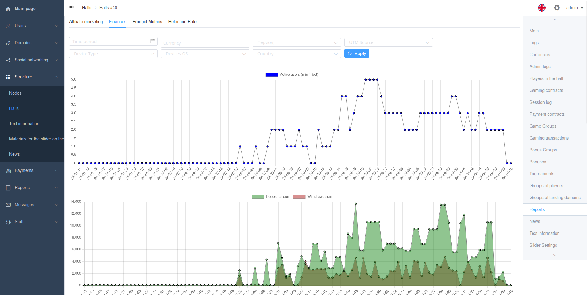

# Graph

Viewset action with inline_type `InlinesType.GRAPH`.

Must return `InlineGraphResult` instance. Can contain many charts with ChartData.

Uses `chartjs` library to output graphs.

[ChartJS](https://www.chartjs.org/)



## Example

```python
    @action(
        name='Finances',
        filterset_class=FinancesFilterSet,
        methods=['post'],
        detail=True,
        permission_classes=[IsStaffPermission, ],
        inline_type=InlinesType.GRAPH,
    )
    def finances(self, request, pk, filters, *args, **kwargs):
        ...
        labels = [r['time'].strftime('%y-%m-%d') for r in result]
        graph = InlineGraphResult(
            charts=[
                ChartData(
                    labels=labels,
                    datasets=[
                        GraphDataset(
                            label='Active users',
                            data=[r['Active users'] for r in result],
                            backgroundColor='Blue',
                        ),
                    ],
                ),
                ChartData(
                    labels=labels,
                    datasets=[
                        GraphDataset(
                            label='Deposites sum',
                            data=[r['Deposites sum'] for r in result],
                            backgroundColor='rgba(34, 139, 34, 0.5)',
                            fill='origin',
                        ),
                        GraphDataset(
                            label='Withdraws sum',
                            data=[r['Withdraws sum'] for r in result],
                            backgroundColor='rgba(178, 34, 34, 0.5)',
                            fill='origin',
                        ),
                    ],
                ),
            ],
        )
        return graph

```
