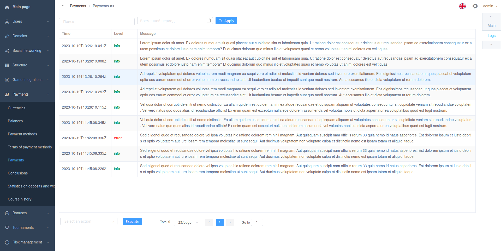

# Table

Viewset action with inline_type `InlinesType.TABLE`.

Must return `InlineTableResult` instance.

You can use `django.core.paginator.Paginator` for paginated response.



## Example

```python
from django_filters import rest_framework as filters

class LogsFilterSet(BaseAdminFilterSet):
    search_text = filters.CharFilter(label=_('Search'))
    date = filters.DateFromToRangeFilter(label=_('Time range'))
```

```python
from django.core.paginator import Paginator

...
    @action(
        name=_('Logs'),
        methods=['post'],
        detail=True,
        permission_classes=[AdminPermission, ],
        inline_type=InlinesType.TABLE,
        actions=[export_csv_inline],
        filterset_class=LogsFilterSet,
    )
    def logs(self, request, pk, filters, *args, **kwargs):
        page = request.GET.get('page', 1)
        page_size = request.GET.get('limit', settings.REST_FRAMEWORK['PAGE_SIZE'])
        search_text = filters.get('search_text', None)

        log_result = ...

        data = [[log.asctime, log.level_colored, log.msg] for log in log_result.logs]
        paginator = Paginator(data, page_size)

        return InlineTableResult(
            messages=messages,
            columns=['Time', 'Level', 'Message'],
            data=paginator.page(page),
            paginator=paginator,
            columns_info={
                'Time': ColumnInfo(width=200),
                'Level': ColumnInfo(width=100, html=True),
            }
        )
```
