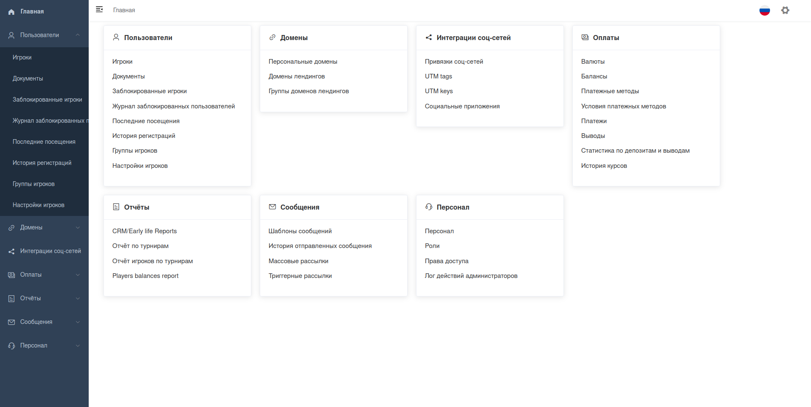

# Django Custom Admin

A custom admin interface providing backend via DRF and frontend via Vue 2 and Element UI that tries Keep It Simple.

## Features

- The web view runs on **Vue 2** using **Element UI**
- Pre-builded Vue SPA front page provided through html template and static files
- All endpoints run on Django Rest Framework view-set's (supports both ORM and non-ORM data sources)
- A powerful inline system with related entities
- Support for **django-modeltranslation** translations
- Ability to output any data within inlines (such as external logs with pagination)
- Ability to create admin actions using forms via drf serializers
- Dynamic system for obtaining partition scheme and interface structure
- Access rights sharing system based on DRF permissioins
- Related fields with autocomplete search
- WYSIWYG editor using TinyMCE 4
- JSON editor using CodeMirror
- Related fields Autocomplete and Filters using Vue Tags Input

## Links
[Django](https://www.djangoproject.com/)

[Vue 2](https://v2.vuejs.org/)

[Element UI](https://element.eleme.io)

[CodeMirror](https://codemirror.net/)

[vue-tags-input](http://www.vue-tags-input.com)
