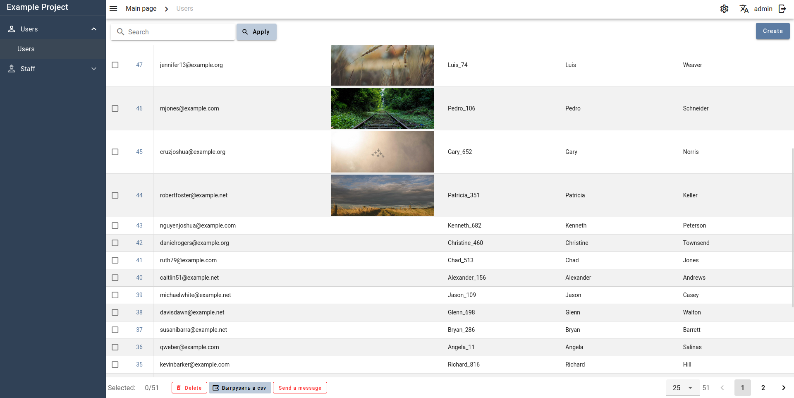

# Django Custom Admin

A custom admin interface on Vue 3 and Vuetify with DRF backend that tries to Keep It Simple.

## Features

- The web view runs on **Vue 3** using **Vuetify**
- Pre-builded Vue SPA front page provided through Django html template/static files
- All endpoints run on Django Rest Framework view-set's (supports both ORM and non-ORM data sources)
- A powerful inline related entities system
- Related fields with autocomplete search
- Support for **django-modeltranslation** translations
- Ability to output any data within inlines (such as external logs with pagination)
- Ability to create inline admin actions using forms via DRF serializers
- Dynamic system for obtaining partition scheme and interface structure
- Access rights sharing system based on DRF permissioins

**Custom fields**
- WYSIWYG editor using TinyMCE 5
- JSON editor using CodeMirror and JSONForms
- Autocomplete for related fields and filters using API

# Screenshots

**Login page**

**Dashboard**

**Create view**

**Edit page**

**Table page**

## Links
[Django](https://www.djangoproject.com/)

[Vue 3](https://vuejs.org/)

[Vuetify](https://vuetifyjs.com/)

[CodeMirror](https://codemirror.net/)

[JSONForms](https://jsonforms.io/)
