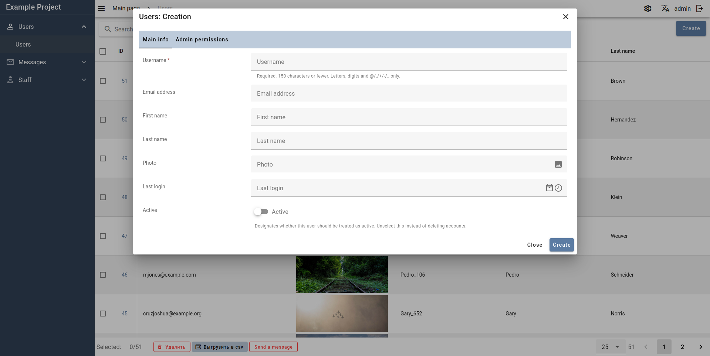

# Django Custom Admin

A custom admin interface on Vue 3 and Vuetify with DRF backend that tries to Keep It Simple.

### Features

- Interface for [DRF](https://www.django-rest-framework.org/) API based on **[Vue 3](https://vuejs.org/)** and **[Vuetify](https://vuetifyjs.com/)**
- Pre-builded Vue SPA front page provided through [Django](https://www.djangoproject.com/) template/static files. A separate setup for the front end is not required.
- Ability to create inline admin actions using forms via DRF serializers
- Dynamic system for obtaining partition scheme and interface structure
- Access rights sharing system based on DRF permissioins

**Custom fields**
- Related fields/filters with autocomplete search
- WYSIWYG editor using [TinyMCE](https://www.tiny.cloud/docs/tinymce/latest/)
- JSON editor using [svelte-jsoneditor](https://github.com/josdejong/svelte-jsoneditor) and [JSONForms](https://jsonforms.io/)
- Autocomplete for related fields and filters using API
- Support for [django-modeltranslation](https://readthedocs.org/projects/django-modeltranslation/) translations

**Non ORM inlines**
- Table views
- Support for graphs using [chartjs](https://www.chartjs.org/)

## Screenshots

**Login page**

**Dashboard**

**Create view**

**Edit page**

**Table page**

