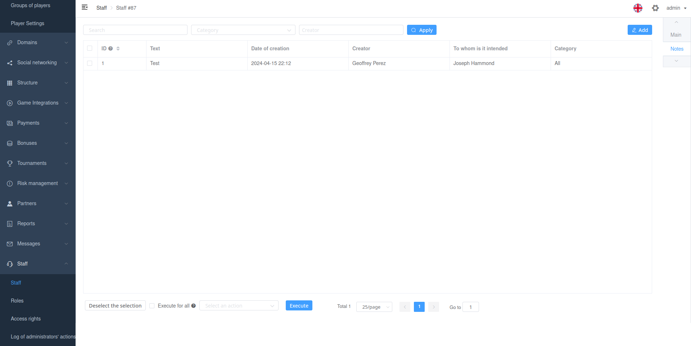

# Viewset Related inlines

The `related_inlines` parameter allows you to add related lnlines viewsets settings. It is possible to add both ORM and non-ORM viewsets.

Each setting must be an instance of `RelatedInline`.

## Attributes of RelatedInline

- `title`\
Displayed title in sections (tabs)

- `viewset_name`\
Name of viewset.\

You can use the django manage command to show all sets of admin views:\
`manage.py custom_admin_viewsets_list`

- `inline_slug`\
The unique string that will be used in the url.

- `icon`\
Icon. [List](https://pictogrammers.com/library/mdi/)

- `back_relation_name`\
Optional. It's necessary for ORM relations. You need to specify a field or lookup for the reverse filter.



## ORM inline

For ORM inline you just need specify `back_relation_name`.

For non-ORM inlines, check out the section `Non ORM Inlines`.

## Example

```python
import typing
from custom_admin.api import RelatedInline

class StaffAdminViewSet(BaseAdminViewSet):
    ...

    related_inlines: typing.List[RelatedInline] = [
        RelatedInline(
            viewset_name='note',
            back_relation_name='user',
            inline_slug='staff_notes',
            title=_('Notes'),
        ),
    ]
```
