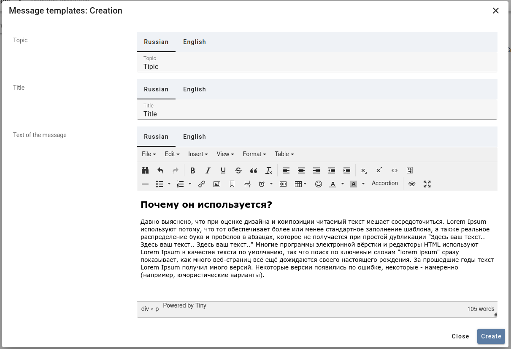

# Serializer field options

## Tag style

`tag_style` - option to specify a color for certain string values


*Example*

Serializer:
```python
    class Meta:
        model = Payment
        extra_kwargs = {
            'status': {'tag_style': TransactionStatus.get_style()},
        }
```

Styles:
```python
    @classmethod
    def get_style(cls):
        return {
            cls.SUCCESS.value: 'green',
            cls.ERROR.value: 'red',
        }
```

## Wysiwyg

`wysiwyg` - option to enable TinyMCE editor.

[TinyMCE link](https://www.tiny.cloud/docs-4x/demo/classic/)



*Example*

```python
        extra_kwargs = {
            'description': {'wysiwyg': True},
        }
```

## Multiline

`multilined` - option to specify a text field in multiple lines.

*Example*

```python
        extra_kwargs = {
            'note': {'multilined': True},
        }
```

## Table image preview

`list_preview` - display image inside table list.

*Example*

```python
        extra_kwargs = {
            'image': {'list_preview': True},
        }
```
