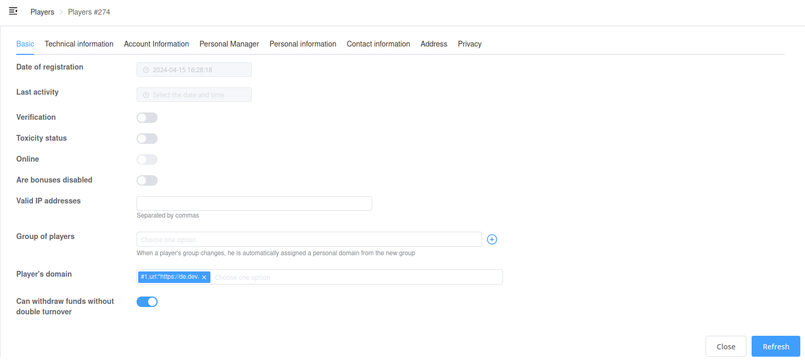

# Serializer field groups

You can specify the `groups` parameter inside serializer `Meta` class to have your fields displayed in different sections.

This is purely for visual display on the front. The update request will work as before.

Each groups element must contain:

- `title`\
String name for display inside sections (tabs).

- `fields`\
List of serializer fields.



## Example

```python
    class Meta:
        model = User
        groups = [
            {'title': _('Base info'), 'fields': (
                'verification',
                'allowed_ip',
                'date_joined',
                'last_activity',
                'is_online',
                'group',
            )},
            {'title': _('Tech info'), 'fields': (
                'external_id',

                'last_visit_datetime',
                'last_visit_language',
                'last_visit_device',
                'last_visit_ip',
                'last_visit_geo_ip',
            )},
        ]
```
