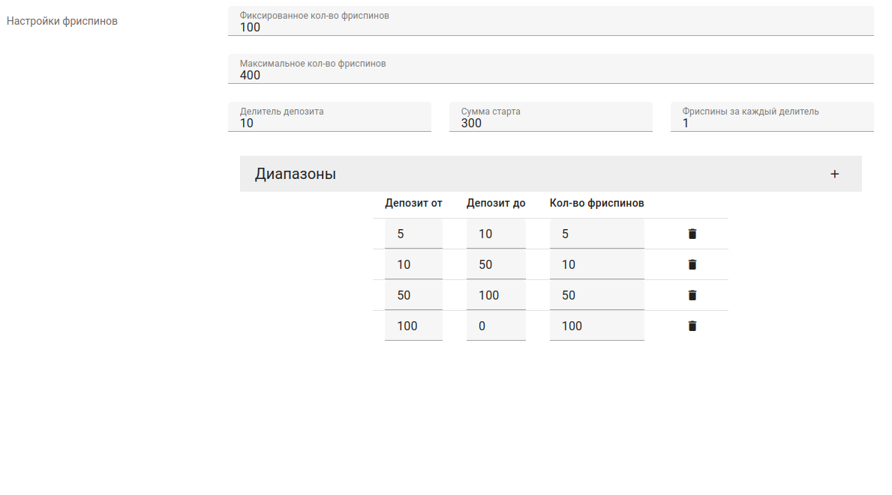

# JSON Forms

It is possible to create custom forms for JSON fields on the project, JSONForms lib is used for this purpose.

[JSONForms](https://jsonforms.io/)

[Vuetify forms examples](https://jsonforms-vuetify-renderers.netlify.app/#/example/control)

To use this field, you need to add the `json_forms` with `schema` and `uischema` parameter to the field in the serializer.

## Example:



```python
JSON_FORMS = {
    'schema': {
        "type": "object",
        "properties": {
            "max_total": {
                "title": _("Максимальное кол-во фриспинов"),
                "type": "number",
            },
            "fix_value": {
                "title": _("Фиксированное кол-во фриспинов"),
                "type": "number",
            },
            "division": {
                "title": _("Делитель депозита"),
                "type": "number",
            },
            "division_from": {
                "title": _("Сумма старта"),
                "type": "number",
            },
            "division_value": {
                "title": _("Фриспины за каждый делитель"),
                "type": "number",
            },
            "ranges": {
                "type": "array",
                "items": {
                    "type": "object",
                    "properties": {
                        "from": {
                            "title": _("Депозит от"),
                            "type": "number",
                        },
                        "to": {
                            "title": _("Депозит до"),
                            "type": "number",
                        },
                        "value": {
                            "title": _("Кол-во фриспинов"),
                            "type": "number",
                        }
                    }
                }
            }
        }
    },
    'uischema': {
        "type": "VerticalLayout",
        "elements": [
            {
                "type": "Control",
                "scope": "#/properties/fix_value"
            },
            {
                "type": "Control",
                "scope": "#/properties/max_total"
            },
            {
                "type": "Category",
                "elements": [
                    {
                        "type": "HorizontalLayout",
                        "elements": [
                            {
                                "type": "Control",
                                "scope": "#/properties/division"
                            },
                            {
                                "type": "Control",
                                "scope": "#/properties/division_from"
                            },
                            {
                                "type": "Control",
                                "scope": "#/properties/division_value"
                            },
                        ],
                    },
                ],
            },
            {
                "type": "Control",
                "label": _("Диапазоны"),
                "scope": "#/properties/ranges",
            },
        ]
    }
}
```

```python
    class Meta:
        ...
        extra_kwargs = {
            json_field': {'json_forms': FREESPINS_JSON_FORMS},
        }
```
