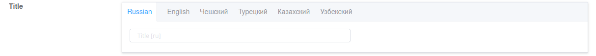

# Serizlisers

## `AdminModelSerializer`

Viewset serializers must be inherited from `custom_admin.api.serializers.AdminModelSerializer` class.

AdminModelSerializer provided:

- Custom fields
- Functionality for logging actions inside the admin panel

## `TranslatedModelSerializer`



Requires library [django-modeltranslation](https://pypi.org/project/django-modeltranslation/)

Provides the ability to automatically add fields with translations to the serializers.

## `OrderedAdminModelSerializer`

Requires library [django-ordered-model](https://pypi.org/project/django-ordered-model/)

Calls `OrderedModel.to()` method to effect a re-ordering.

`order_field` can be specified or `model.order_field_name` will be used.

# Serializers fields

## AdminPrimaryKeyRelatedField

Available options:

- `update_only` - boolean

- `create_only` - boolean

- `filter_queryset` - function `filter_currency_info(qs, form_data: dict, request=None)`

It allows to provide results for selection depending on other form fields.

`form_data` - contains dict with form data containing all fields.\
`qs` - initial queryset.


# Example:

```python
from custom_admin.api.serializers import AdminModelSerializer
from custom_admin.api.views.base_admin_viewset import BaseAdminViewSet
from django.utils.translation import gettext_lazy as _

from apps.users.models import User


class UserAdminSerializer(AdminModelSerializer):
    class Meta:
        fields = (
            'id',
            'username',
            'email',
            'first_name',
            'last_name',
            'photo',
            'date_joined',
            'last_login',
            'is_active',

            'is_superuser',
            'is_staff',
            'groups',
            'user_permissions',
        )
        groups = [
            {'title': _('Main info'), 'fields': (
                'id',
                'username',
                'email',
                'first_name',
                'last_name',
                'photo',
                'date_joined',
                'last_login',
                'is_active',
            )},
            {'title': _('Admin permissions'), 'fields': (
                'is_superuser',
                'is_staff',
                'groups',
                'user_permissions',
            )},
        ]
        model = User
        extra_kwargs = {
            'photo': {'list_preview': True},
            'date_joined': {'read_only': True},
        }


class UsersAdminViewSet(BaseAdminViewSet):
    serializer_class = UserAdminSerializer
    queryset = User.objects.all()
    search_fields = (
        'username',
        'email',
        'first_name',
        'last_name',
    )
    list_display = (
        'id',
        'email',
        'photo',
        'username',
        'first_name',
        'last_name',
    )
```
