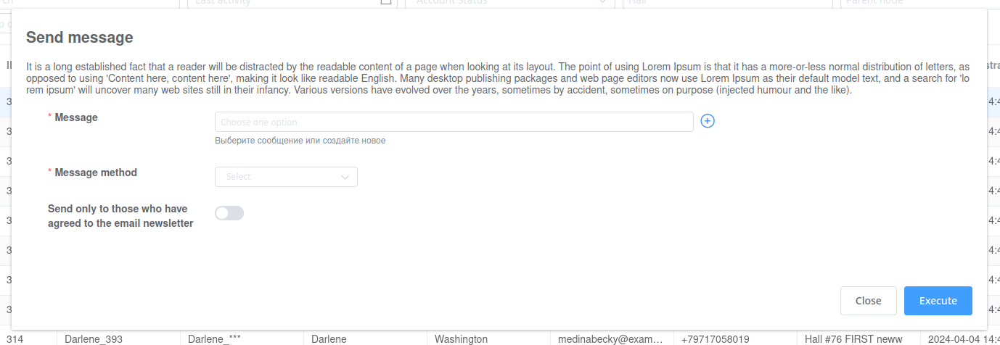
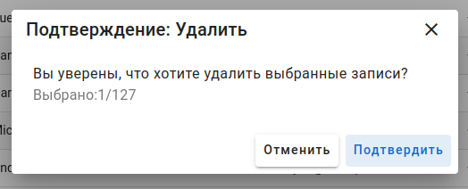
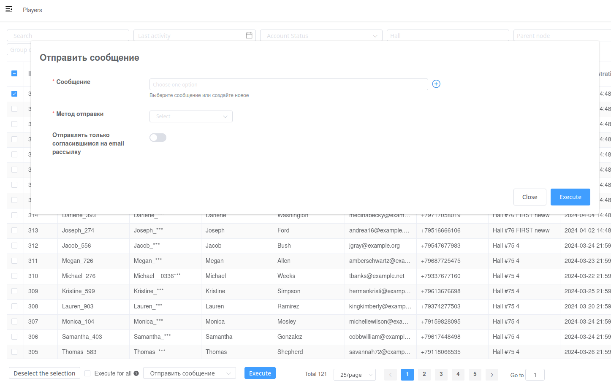

# Actions

In viewset `actions` list, you can specify functions that can be called from the list view.

You can specify settings through decorator `custom_admin.api.admin_action`

Available settings:

- `short_description`\
The name that will be displayed as title.

- `form_serializer`\
Optional parameter for action form output.

- `description`\
The text that will be displayed next to the title on the popup form.



- `confirmation_text`\
Text output to confirm that the action has been performed.



- `base_color`\
Any rgb or html colors.

- `variant`\
Options: elevated, flat, tonal, outlined, text, and plain.


## Response messages format

`custom_admin.api.actions.action_result.ActionResult` is used for message output.

```python
return ActionResult(messages=[_('Success')])
```

- List messages with status code:
```python
return ActionResult(messages=[_('Error')], status_code=400)
```

- `Response` or `HttpResponse` instance for custom responses:

```python
    response = HttpResponse(f, content_type='text/csv')
    response['Pragma'] = filename
    response['Content-Disposition'] = f'attachment; filename="{filename}"'
    f.close()
    return response
```

### Persistent message

Ability to display a message to the administrator that will not be hidden automatically. html tags allowed.


```python
from custom_admin.api import admin_action
from custom_admin.api.actions.action_result import ActionResult
from django.utils.translation import gettext as _

MESSAGE = '''
<b>Reset link:</b><br>
{url}<br>
<br>
<b>Lifetime:</b> {livetime}
'''


@admin_action(
    short_description=_('Получить ссылку на сброс пароля'),
    icon='mdi-lock-outline',
)
def reset_password_link(view, request, queryset, *args, **kwargs) -> ActionResult:
    ...
    msg = MESSAGE.format(
        url=url,
        livetime=datetime.timedelta(seconds=lifetime),
    )
    return ActionResult(persistent_message=msg)
```

## Action form

In `form_serializer` parameter you can pass instance of `AdminSerializer` to display the form before submitting the action.



```python
from custom_admin.api import fields
from custom_admin.api.serializers import AdminSerializer

class AdminSendMessageSerializer(AdminSerializer):
    message = fields.AdminPrimaryKeyRelatedField(
        queryset=Message.objects.all(),
        label=_('Message'),
        required=True,
    )
    send_method = fields.AdminChoiceField(
        label=_('Method'),
        choices=MessageType.choices,
        required=True
    )

    class Meta:
        fields = [
            'message', 'send_method',
        ]
```

```python
from custom_admin.api import admin_action

@admin_action(
    short_description=_('Send a message'),
    form_serializer=AdminSendMessageSerializer,
    base_color='#ff3333',
    variant='outlined',
)
def send_message_action(view, request, queryset, form_data):
    serializer = AdminSendMessageSerializer(data=form_data)
    serializer.is_valid(raise_exception=True)

    message = serializer.validated_data['message']
    ...
    return 'Success', 200
```

```python
    actions = BaseAdminViewSet.actions + [
        send_message_action,
    ]
```
