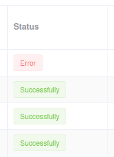
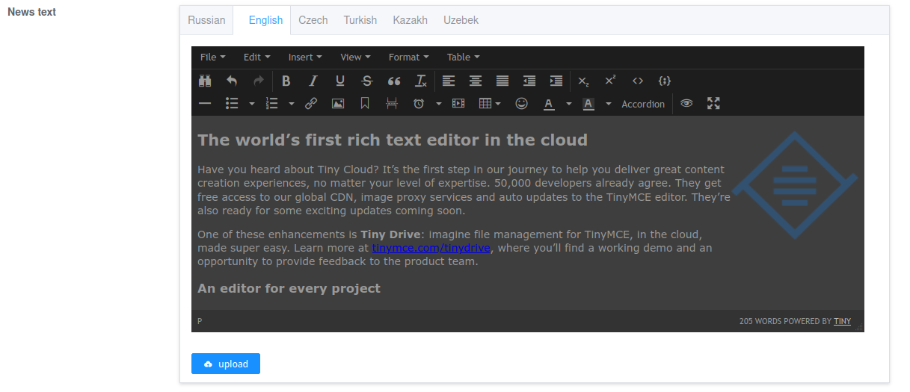

# Serializer field options

## Tag style

Option to specify a style for certain string values

[Element UI reference](https://element.eleme.io/#/en-US/component/button)



*Example*

```python
    class Meta:
        model = Payment
        extra_kwargs = {
            'status': {'tag_style': TransactionStatus.get_style()},
        }
```

## Wysiwyg

Option to enable TinyMCE editor.

[TinyMCE link](https://www.tiny.cloud/docs-4x/demo/classic/)



*Example*

```python
        extra_kwargs = {
            'description': {'wysiwyg': True},
        }
```

## Multiline

Option to specify a text field in multiple lines.

*Example*

```python
        extra_kwargs = {
            'note': {'multilined': True},
        }
```
