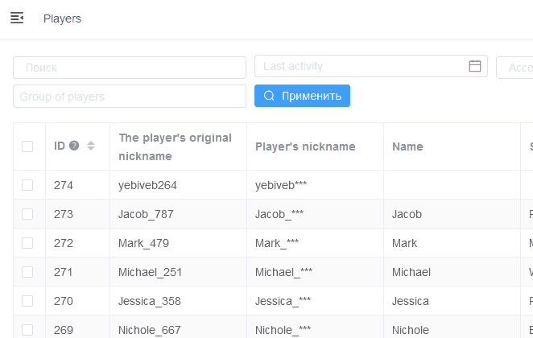

# Serializer fixed columns

Viewset parameter `fixed_columns` allows to specify fields that will be fixed when horizontal scrolling.



## Example

```python
    fixed_columns = (
        'id',
        'username',
    )
```
