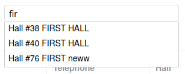

# Models settings

## Tag search

Model attribute `admin_autocomplite_fields` is specify which fields will be used for tag search (filters, related fields).



```
admin_autocomplite_fields = ('id', 'nickname')
```
