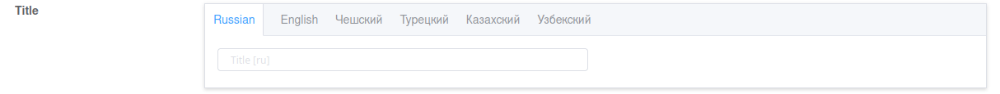

# Serizlisers

## `AdminModelSerializer`

Viewset serializers must be inherited from `custom_admin.api.serializers.AdminModelSerializer` class.

AdminModelSerializer provided:

- Custom fields
- Functionality for logging actions inside the admin panel

## `TranslatedModelSerializer`



Requires library [django-modeltranslation](https://pypi.org/project/django-modeltranslation/)

Provides the ability to automatically add fields with translations to the serializers.

## `OrderedAdminModelSerializer`

Requires library [django-ordered-model](https://pypi.org/project/django-ordered-model/)

Calls `OrderedModel.to()` method to effect a re-ordering.

`order_field` can be specified or `model.order_field_name` will be used.

# Serializers fields

## AdminPrimaryKeyRelatedField

Available options:

- `update_only` - boolean

- `create_only` - boolean

- `filter_queryset` - function `filter_currency_info(qs, form_data: dict, request=None)`

It allows to provide results for selection depending on other form fields.

`form_data` - contains dict with form data containing all fields.\
`qs` - initial queryset.


# Example:

```python
from custom_admin.api import fields
from custom_admin.api.serializers import AdminModelSerializer
from django.utils.translation import gettext_lazy as _


def filter_currency_info(qs, form_data: dict, request=None):
    parent_node_info = form_data.get('parent_node')
    if parent_node_info:
        instance = Node.objects.get(id=parent_node_info['id'])
        if instance.parent_node:
            parent_currencies = instance.parent_node.get_available_currencies()
            return qs.filter(code__in=parent_currencies)

        return qs

    return Currency.objects.filter(is_active=True)


class NodeAdminSerializer(AdminModelSerializer):
    currencies = fields.AdminPrimaryKeyRelatedField(
        label=_('Available currencies'),
        queryset=Currency.objects.filter(is_active=True),
        filter_queryset=filter_currency_info,
        many=True,
        required=False,
    )

    class Meta:
        model = Node
        fields = ['id', 'title', 'parent_node', 'currencies', 'comment']
        extra_kwargs = {
            'comment': {
                'wysiwyg': True
            },
        }

    def validate(self, data):
        if data.get('parent_node'):
            currencies = data.get('currencies')
            data['currencies'] = data.get('parent_node').currencies.filter(
                code__in=[currency.code for currency in currencies])
        return data
```
